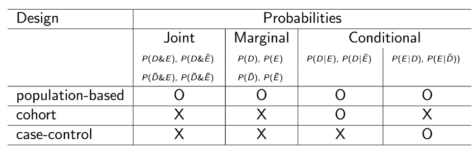

#STAT 453 - Exam Notes
###By: Jordan Poles

##Study Design

Population: We draw a SRS from the entire population. Assumes that proportions in sample match those in population.

Cohort: We draw SRS from each subgroup (exposed/unexposed).

Case-control: We manipulate the subjects in order to assort them into case or control groups.

##Disease-Exposure Associations

####Relative Risk

$$
RR = \frac{P(D|E)}{P(D|!E)}
$$

####Odds Ratio
Odd ratio measures association by comparing the odds of D in the exposed and unexposed subgroups.

$$
OR = \frac{P(D|E)}{P(!D|E)}/\frac{P(D|!E)}{P(!D|!E)} = \frac{ad}{bc}
\\
= RR * \frac{P(!D|E)}{P(!D|!E)} = \frac{P(D|E)}{P(D|!E)}* \frac{P(!D|E)}{P(!D|!E)}
\\
\hat{Var}(log[\hat{OR}]) = \frac{1}{a} + \frac{1}{b} + \frac{1}{c} + \frac{1}{d}
$$

####Small Sample Adjustment

$$
  OR_{SS} = \frac{(a+.5)(d+.5)}{(b+.5)(c+.5)}
  \\
  \hat{Var}(log[\hat{OR}]) = \frac{1}{a+.5} + \frac{1}{b+.5} + \frac{1}{c+.5} + \frac{1}{d+.5}
$$

####Attributable Risk
Measures the rate at which an individual becomes diseased without exposure to the factor of interest.

$$
AR = \frac{P(D) - P(D|~E)}{P(D)}
$$

####Excess Risk
Additive measure of the impact of exposure on risk of disease development. Or, the excess number of cases, as a fraction of the
population size, when population members are all exposed as compared to them all being unexposed.

$$
ER = P(D|E) - P(D|!E)
$$

##Stratified Analysis

We use the below tests to test if there is a common odds ratio underlying our stratified data. If so, we can then use the Woolf/CMH correction to find a unified odds ratio across our strata.

####Woolf's Test of Homogeneity
For $I$ strata:
 
$H_0: OR_1 = OR_2 = ... = OR_I$
 
$H_A:$ At least one OR differs from others

$$
  \chi_H^2 = \sum \frac{(log[\hat{OR_i}] - log[\hat{OR_W}])^2}
  {Var(log[\hat{OR_i}])} \sim X^2_{I-1}
$$

####Woolf's correction

$$
log(\hat{OR_W}) = \frac{\sum w_i log(\hat{OR_i})}{\sum w_i}
\\
log(\hat{OR_i}) = log[\frac{(a+.5)(d+.5)}{(b+.5)(c+.5)}]
\\
w_i = \frac{1}{Var(log(\hat{OR_i}))}
$$

####Cochran-Mantel-Hanzel Test of Independence
The Cochran-Mantel-Haenszel test statistic is zero (“perfect” independence) if and only if \hat{OR}_{MH} = 1
$$
  \chi_{CMH}^2 = \sum \frac{(a_i - E[a_i])^2}{Var(a_i)}
  \\
  E[a_i] = \frac{(a_i + b_i)(a_i + c_i)}{n_i}
  \\
  Var(a_i) = \frac{(a_i+b_i)(c_i + d_i)(a_i + c_i)(b_i + d_i)}{n_i^2(n_i-1)}
$$

####Mantel-Hanzel Correction

$$
log(\hat{OR}_{MH}) = \frac{\sum w_i log(\hat{OR_i})}{\sum w_i} =
\frac{\sum (a_i d_i / n_i)}{\sum (b_i c_i / n_i)}
\\
w_i = b_i c_i / n_i
$$

##Logistic Regression

$$
log(\frac{p}{1-p}) = a + bx
$$

In order to test if a variable has influence controlling for all other variables in the logistic regression we establish a null hypothesis of $H_0: x = 0$ for the example logistic equation $log(\frac{p}{1-p}) = a + bx + cy$
