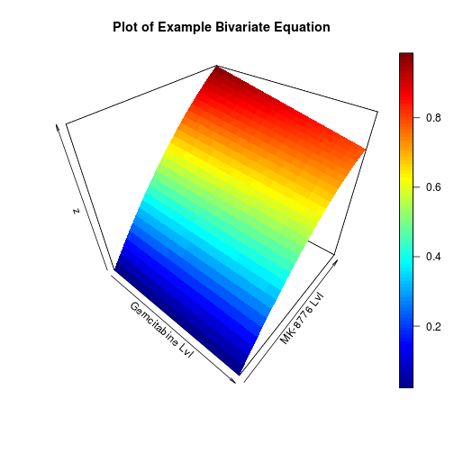
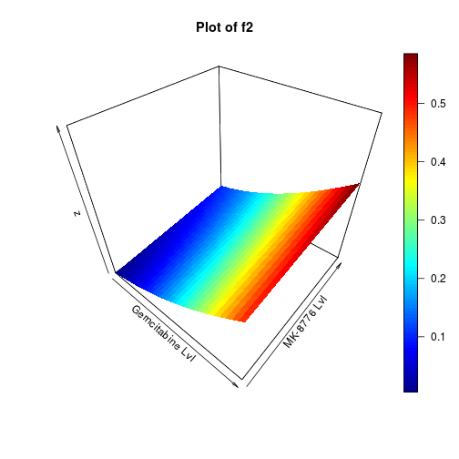
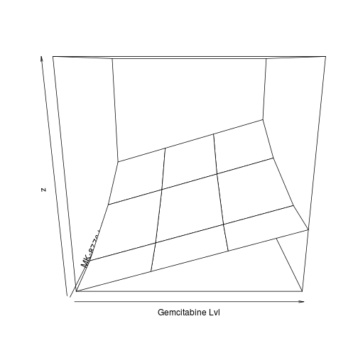
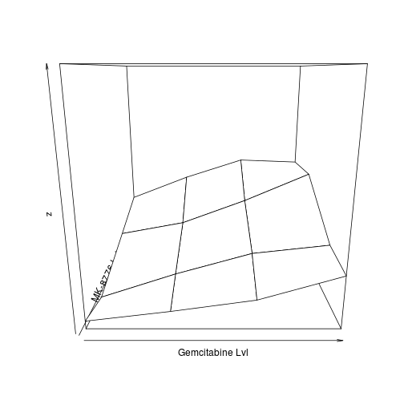
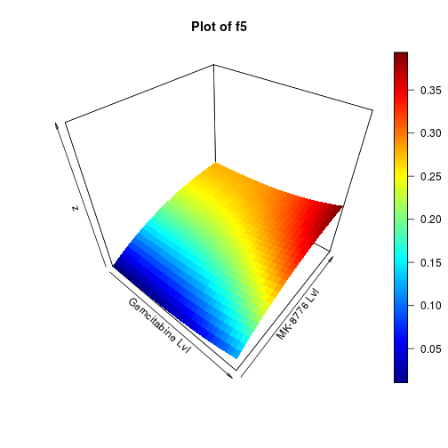
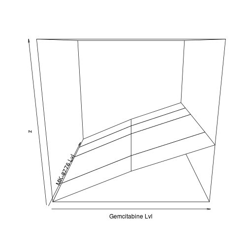

Assessing the BOIN Algorithm using Bivariate Functions for Generative Toxicity Scenarios
========================================================
author: Jordan Poles
date: 4/18/17
autosize: false

Why Generate Toxicity Scenarios?
========================================================

<br>
### Herein, I use procedural generation to describe several different toxicity scenarios using simple bivariate equations. 

#### This allows greater creative freedom and repeatability.
<br>

```r
source("main.R")
example_bivariate = function(i){((i["x"]-13)**3+i["y"]-((i["x"]*i["y"])**3/i["y"]**2))}
```

========================================================
<center>

</center>

What Tools Did I Use?
========================================================

- Created a set of functions in R which make it simple to compose a toxicity scenario using any bivariate equation (the results of which are automatically scaled from 0-1).
- Receive back both a plot of the toxicity scenario in 3D as well as a set of data points in both matrix and plot form.
- Levels for each of the two drugs in question may be set, such that functions can take an numeric array of ordered dosage levels (1-4) or quanitities (20mg, 40mg, 80mg); these values are input into the equation as fractions of the largest value.
- Experimenter can introduce stochasticity by incorporation of a random variable into the generative formula, as we show later.

Single MTD - Scenario 2 of 5
========================================================

Linear relationship with Gemcitabine.
<br>Quadratic growth with MK-8776 level. 
<br>Maxmimum toxicity when both drugs are at maximum.


```r
xside=c(400, 600, 800, 1000)
yside = c(20,40,80,112) 
maxtox=.6
f2
```

```
function (i) 
{
    (i["x"] + i["y"]^2)
}
```

========================================================
<center>

</center>

========================================================

<center>

</center>

Single MTD - Scenario 2 of 5
========================================================


```r
get.oc.comb(.3, scenario_sim(f2, maxtox, xside, yside, 0), 42, 3, n.earlystop=42, startdose=c(1, 1), ntrial=1000, MTD.contour=FALSE)
```

```
True toxicity rate of dose combinations:
 0.00   0.01   0.13   0.30  
 0.10   0.11   0.23   0.40  
 0.20   0.21   0.33   0.50  
 0.30   0.31   0.43   0.60  

selection percentage at each dose combination (%):
 0.00   0.00   1.40  12.50  
 0.30   0.10  15.10   8.90  
 2.70  10.10  22.30   0.90  
 7.00  14.20   4.50   0.00  

number of patients treated at each dose combination:
 3.08   1.73   3.49   6.16  
 2.65   3.37  10.40   7.07  
 3.81   7.59  12.55   2.76  
 3.71   7.78   5.54   0.75  

number of toxicity observed at each dose combination:
 0.00   0.02   0.46   1.89  
 0.25   0.38   2.36   2.81  
 0.76   1.64   4.07   1.39  
 1.07   2.41   2.35   0.46  

average number of toxicities: 22.3 
average number of patients: 82.4 
selection percentage of MTD: 19.5 
percentage of patients treated at MTD: 7.8 
percentage of early stopping due to toxicity: 0.00 
```

Single MTD - Scenario 2 of 5
========================================================
- This toxicity scenario has two possible MTDs, at the extremes of each of the two drug concentrations (1,4 & 4,1). 
- There are some true toxicity values which lie close to, but above, the desired DLT
- These dosages (2,4 & 3,3) were selected at a much greater frequency (17.3+24.4=41.7%) as compared to the desired MTDs (10.1+6.7=16.7%). This is indicative of somewhat poor performance.

Single MTD - Scenario 4 of 5
========================================================
Linear relationship with Gemcitabine.
<br>Quadratic growth with MK-8776 level. 
<br>Maxmimum toxicity when both drugs are at maximum.
<br>Now we have introduced stochasticity!


```r
f4
```

```
function (i) 
{
    (i["x"] + i["y"]^2 + rnorm(1, mean = 0, sd = 0.2))
}
```

========================================================
<center>

</center>

Single MTD - Scenario 4 of 5
========================================================

```r
get.oc.comb(.3, scenario_sim(f4, .45, xside, yside, 0), 42, 3, n.earlystop=42, startdose=c(1, 1), ntrial=1000, MTD.contour=FALSE)
```

```
True toxicity rate of dose combinations:
 0.00   0.00   0.09   0.25  
 0.04   0.09   0.11   0.28  
 0.18   0.09   0.32   0.34  
 0.30   0.26   0.26   0.45  

selection percentage at each dose combination (%):
 0.00   0.00   0.00   6.10  
 0.00   0.00   2.20  15.20  
 2.30   0.70  14.60  15.10  
 5.80  10.10  23.30   4.60  

number of patients treated at each dose combination:
 3.01   1.51   1.78   3.85  
 2.10   2.19   4.81   9.01  
 3.42   3.64  10.09   9.29  
 3.45   6.20  10.99   6.97  

number of toxicity observed at each dose combination:
 0.00   0.00   0.15   1.01  
 0.08   0.17   0.51   2.50  
 0.66   0.32   3.27   3.10  
 1.03   1.63   2.88   3.10  

average number of toxicities: 20.4 
average number of patients: 82.3 
selection percentage of MTD: 0.0 
percentage of patients treated at MTD: 0.0 
percentage of early stopping due to toxicity: 0.00 
```

Single MTD - Trial 1
========================================================


Single MTD - Trial 1
========================================================
<br>
<p style="line-height: 150%">
For my first trial, I had envisioned a simple scenario for the toxicity matrix, but the software exhibited some strange behaviour. 
<br><br>
It only ended up exploring the dosage combinations for a single drug (Gemcitabine), without investigating any of the toxicity characteristics of the second. Thus, I do not believe it found a reasonable MTD.
</p>

Single MTD - Trial 2
========================================================


Single MTD - Trial 2
========================================================
<br>
<p style="line-height: 150%">
In my second trial, the search proceeded normally, and produced a more complete toxicity matrix as would be expected.
<br><br>
The algorithm was also able to find a reasonable choice for the MTD in this scenario. Thus it performed significantly stronger in this case as compared to the first trial.
</p>

Waterfall MTD - Scenario 5 of 5
========================================================


```r
xside=c(600, 800, 1000)
yside=c(20, 40, 80, 100, 120)
maxtox=.4
f5
```

```
function (i) 
{
    ((i["x"] - 5)^3 + (i["y"] - 1)^3)
}
```

========================================================
<center>

</center>

========================================================

<center>

</center>


Waterfall MTD - Scenario 5 of 5
========================================================


Waterfall MTD - Trial 1
========================================================


Waterfall MTD - Trial 1
========================================================
<br>
<p style="line-height: 150%">
In this trial, the algorithm performed a very thourough search of the toxicity matrix. 
<br><br>
It appears to have used the available subjects for each subtrial effectively. It seems that the chosen MTDs are very reasonable given the hypothetical trial scenario.
</p>

Waterfall MTD - Trial 2
========================================================


Waterfall MTD - Trial 2
========================================================
<br>
<p style="line-height: 150%">
In this trial, the early-stopping mechanism of the design kicked-in. The remainder of the trials were not used, but the algorithm did not explore at least one notable dosage combination: (2,2). 
<br><br>
Nonetheless, the chosen MTD values are not unreasonable, though they may not permit maximum efficacy.
</p>
