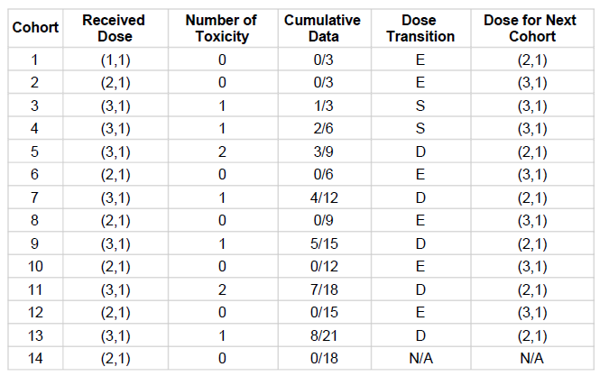
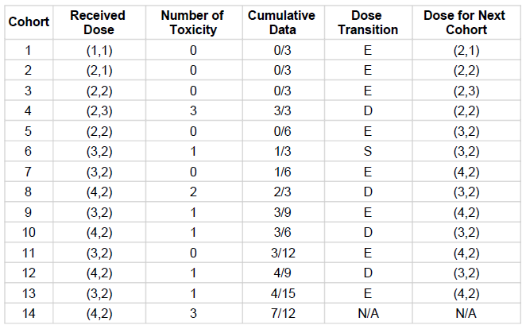
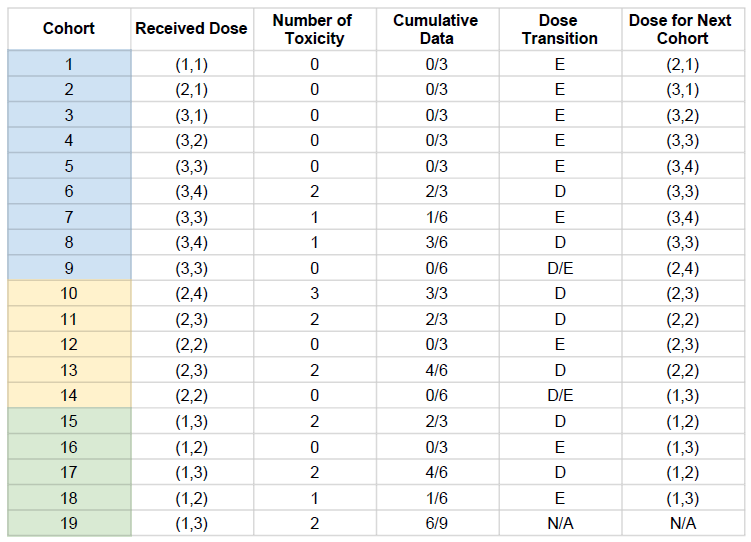
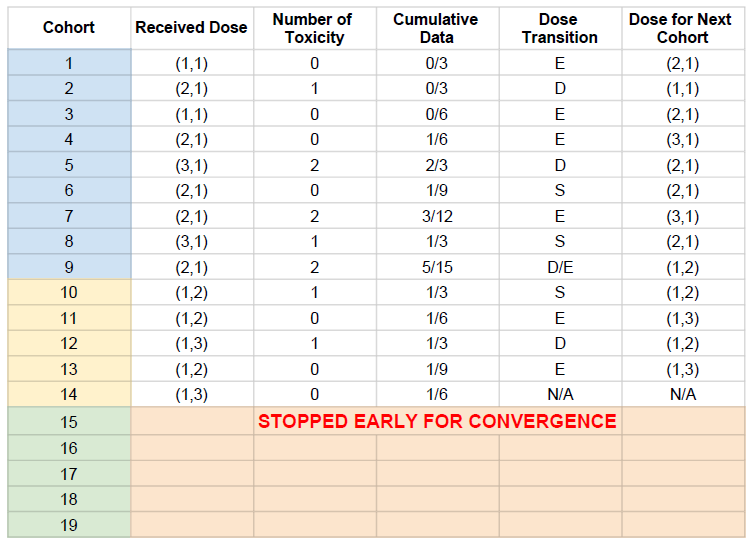

#Assessing the BOIN Algorithm using Bivariate Functions for Generative Toxicity Scenarios
###By: Jordan Poles

---

##Question 1

###Part 1

Here, I simulate the operating characteristics of a BOIN trial design given 5 different meaningful toxicity scenarios of my own design. I decided to take a slightly novel approach, and use procedural generation to describe several different toxicity scenarios using simple bivariate equations. This allows both greater creative freedom as well as repeatability.

I've created a set of functions in R which make it simple to compose a toxicity scenario using any bivariate equation (the results of which are automatically scaled from 0-1), and receive back both a plot of the toxicity scenario in 3D as well as a set of data points (a toxicity level for each level of treatment) which may be input directly into the BOIN R/GUI software in order to discretely simulate the scenario with a given set of drug concentrations. Additionally, the levels for each of the two drugs in question may be set, such that functions can take an numeric array of ordered dosage levels (1-4) or quanitities (20mg, 40mg, 80mg); these values are input into the equation as fractions of the largest value. If the experimenter wished to introduce some stochasticity at this stage, we suggest the incorporation of a random variable into the generative formula, as we show in one of our scenarios.

---

This report was generated using knitr with RMarkdown. The code which drives my report is as follows:

```{r}
library(BOIN)
library(ggplot2)
library(gridExtra)
library(plot3D)
f1 = function(i){(i["x"]+i["y"])}
f2 = function(i){(i["x"]+i["y"]**2)}
f3 = function(i){((i["x"])**2+(.2*i["y"]))}
f4 = function(i){(i["x"]+i["y"]**2+rnorm(1, mean = 0, sd = .2))}
f5 = function(i){((i["x"]-5)**3+(i["y"]-1)**3)}
plot_sim = function(fn, maxtox, name="fn", output=0){
  side = seq(1,4,.1)
  siderange = c(min(side), max(side))
  xy = as.vector(expand.grid(side, side))
  colnames(xy) = c("x", "y")
  z = apply(xy, 1, fn)
  #scale 0 to 1
  z = scale(z, center = min(z), scale = max(z)-min(z))*maxtox
  ds = cbind(xy, z)
  z = matrix(z, ncol=length(side), byrow=TRUE)
  #p = plot_ly(z=~z) %>% add_surface() %>% layout(title=paste('Plot of', name))
  #p = ggplot(data=ds, aes(x=x, y=y, z=z))+geom_contour()
  if(output){
    persp3D(side, side, z, xlab="Gemcitabine Lvl", ylab="MK-8776 Lvl", main = paste('Plot of', name), zlim=c(0, 1))
  }
  return(ds)
}
side = c(1:4)
scenario_sim = function(fn, maxtox, xside=side, yside=side, output=0){
  xside = scale(xside, center = min(xside), scale = max(xside)-min(xside))
  yside = scale(yside, center = min(yside), scale = max(yside)-min(yside))
  xy = as.vector(expand.grid(xside, yside))
  colnames(xy) = c("x", "y")
  z = apply(xy, 1, fn)
  #scale 0 to 1
  z = scale(z, center = min(z), scale = max(z)-min(z))*maxtox
  ds = cbind(xy, z)
  z = t(matrix(z, ncol=length(xside), byrow=TRUE))
  if(output){
    persp(xside, yside, z, xlab="Gemcitabine Lvl", ylab="MK-8776 Lvl", zlim=c(0, 1))
  }
  return(z)
}
sims = c(f1, f2, f3, f4, f5)
names = c("f1", "f2", "f3", "f4", "f5")
outcomes = c()
scenarios = c()
for(i in seq_along(sims)){
  sim = sims[[i]]
  sim_name = names[i]
  outcome = plot_sim(sim, 1, sim_name, output=0)
  scenario = scenario_sim(sim, 1)
  scenarios = append(scenarios, list(scenario))
  outcomes = rbind(outcomes, cbind(outcome, i))
}
```

---

A summary of our different toxicity scenarios can be seen below. I visualized each true toxicity surface using contor plots, and later sample discret points from each surface to construct my true toxicity matrix.

```{r}
xside=c(400, 600, 800, 1000)
yside = c(20,40,80,112) 
ggplot(data=outcomes, aes(x=x,y=y,z=z, colour=..level..))+geom_contour()+facet_wrap(~i)
```

---

I find that the interpreting the goodness of the MTD Operating Characteristics for a given scenario was rather cumbersome, given the available metrics. Thus I propose a novel metric, which can be maximized in order to optimize performance among a given family of single MTD scenarios. I propose summing the selection percentage divided by the the distance between desired DLT and true dosage toxicity to the 4th power (though this parameter can be adjusted to suit the situation, and the desired diminuition of score as distance increases). I would have liked to apply this function to my scenarios, but I was unable to get the function to return a selection percentage matrix.

$$
  \sum\sum{\frac{SelPct}{({DLT}_{Desired} - {TrueTox}_{i,j})^4}}
$$

####Toxicity Scenarios

My toxicity scenarios, defined by functions which will be reiterated below, can now be visualized and tested using R (with the BOIN and plot3D packages). 

---

1) A linear relationship with both drugs. Maxmimum toxicity when both drugs are at maximum. Here, and in the following scenarios, we assume that dosage levels are set such that 100% toxicity never occurs (we estimate max 60% toxicity).
```{r, cache=TRUE}
f1
maxtox=.6
ds = plot_sim(f1, maxtox, "f1", 1)
scenario_sim(f1, maxtox, xside, yside, 1)
get.oc.comb(.3, scenario_sim(f1, maxtox, xside, yside, 0), 42, 3, n.earlystop=42, startdose=c(1, 1), ntrial=1000, MTD.contour=FALSE)
```
The above operating charactertistics describe the results of 1000 simulated trials of the BOIN algoritm on this scenario. Given the true toxicities at each dosage in the first matrix, we find fairly strong performance in the second matrix. Our dosages which have toxicities matching the desired MTD of 0.3 are selected at a high rate (10%+21.9%+9.5%=41.4%) 

---

2) A linear relationship with Gemcitabine; quadratic growth with MK-8776 level. Maxmimum toxicity when both drugs are at maximum.
```{r, cache=TRUE}
f2
ds = plot_sim(f2, maxtox, "f2", output=1)
scenario_sim(f2, maxtox, xside, yside, 1)
get.oc.comb(.3, scenario_sim(f2, maxtox, xside, yside, 0), 42, 3, n.earlystop=42, startdose=c(1, 1), ntrial=1000, MTD.contour=FALSE)
```
This toxicity scenario has two possible MTDs, at the extremes of each of the two drug concentrations (1,4 & 4,1). There are some true toxicity values which lie close to, but above, the desired DLT; strangely, these dosages (2,4 & 3,3) were selected at a much greater frequency (17.3+24.4=41.7%) as compared to the desired MTDs (10.1+6.7=16.7%). This is indicative of somewhat poor performance.

---

3) In this scenario, there is little change in toxicity as Gemcitabine level increases, while the second drug causes much greater toxicity at high levels
```{r, cache=TRUE}
f3
ds = plot_sim(f3, maxtox, "f3", output=1)
scenario_sim(f3, maxtox, xside, yside, 1)
get.oc.comb(.3, scenario_sim(f3, maxtox, xside, yside, 0), 42, 3, n.earlystop=42, startdose=c(1, 1), ntrial=1000, MTD.contour=FALSE)
```
In this scenario, we have no values which lie exactly on the desired DLT, but a couple which lie quite close (particularly 3,3 & 4,3). These points are selected for quite well (22.7+32.8=55.5%), though I find it rather odd that the value with a true toxicity rate of 0.32 is selected at a higher rate. Notably, this is a situation in which the existing metric (particularly selection percentage of MTD) does not capture the strength/fit of our algorithm in this case. 

---

4) In this scenario, we return to the toxicity structure created for our second scenario, but this time also introduce a randomized element, in order to demonstrate this feature (stochasticity) of my approach.

```{r}
f4
ds = plot_sim(f4, .45, "f4", output=1)
scenario_sim(f4, .45, xside, yside, 1)
get.oc.comb(.3, scenario_sim(f4, .45, xside, yside, 0), 42, 3, n.earlystop=42, startdose=c(1, 1), ntrial=1000, MTD.contour=FALSE)
```

Given that this case is stochastically generated based upon a previous scenario, the results will be different with each run. Upon several trials, I have noticed that there is variable success in the selection of a dosage at or around the DLT. In several cases, there were significantly greater rates of selection for those values near the DLT, as compared to exact values of 0.3.

---

5) A complex underlying toxicity function, which models what may be a more realistic dose/toxicity curve. Minimum toxicity is found at an intermediate dosage, of Gemcitabine, while dosage of MK-8776 had a less robust, but semi-protective effect at high dosage levels. 
```{r}
f5 = function(i){((i["x"]-3)**3+(i["y"]-1)**3)-(2*i["x"]*i["y"])}
ds = plot_sim(f5, maxtox, "f5", output=1)
scenario_sim(f5, maxtox, xside, yside, 1)
get.oc.comb(.3, scenario_sim(f5, maxtox, xside, yside, 0), 42, 3, n.earlystop=42, startdose=c(1, 1), ntrial=1000, MTD.contour=FALSE)
```
In this scenario, we have no values which lie exactly on the DLT of 0.3, but several which lie right below this point. These toxicities all happen to fall around the 2nd column in the first matrix, and this column has correspondigly high selection percentages for this column in the second matrix. Oddly enough, however, the dosage with the highest selection percentage was (4,2), a high dosage value for one drug. This dosage was also less near to the DLT as compared to (3,2). Nonetheless, these operating characteristics are indicative of a strong trial design.

---

A major shortcoming of the BOIN R package, which became apparent during the aforementioned analysis, was the inability to easily extract the selection percentage matrix. I highly recommend the addition of this feature. I discuss this issue further in Question 3.

###Part 2

Here I create two realistic phase 1 clinical trial scenarios in the BOIN GUI in order to test the functionality of the BOIN algorithm and software for the purpose of finding a single MTD. I utilize a sample size of 42, with a cohort size of 3 for each of the two trials.

For my first trial, I had envisioned a simple scenario for the toxicity matrix, but the software exhibited some strange behaviour, such that it only ended up exploring the dosage combinations for a single drug (Gemcitabine), without investigating any of the toxicity characteristics of the second. Thus, I do not believe it found a reasonable MTD.



In my second trial, the search proceeded normally, and produced a more complete toxicity matrix as would be expected. The algorithm was also able to find a reasonable choice for the MTD in this scenario. Thus it performed significantly stronger in this case as compared to the first trial.



##Question 2

###Part 1

Here we repeat our examination of the aforementioned 5 true toxicity scenarios, but here we use the BOIN waterfall design in order to select multiple MTDs (one per row), rather than a single MTD per run. Here we also use a slightly lower DLT (0.25)

```{r}
xside=c(600, 800, 1000)
yside=c(20, 40, 80, 100, 120)
maxtox=.4
```

---

1) Here the BOIN waterfall algorithm perfomance is fine for selecting appropriate dosages from our first scenario. We see that the most appropriate dosage likely lies at (3,2 or 2,4), and that the former dosage has the highest selection percentage in its row (though not by much). For the second case, however, the algorithm picks a slightly lower dosage toxicity (.22) over a closer dosage (.26) 7.5% of the time.
```{r, cache=TRUE}
get.oc.comb(.25, scenario_sim(f1, maxtox, xside, yside, 1), ncohort=c(27,15,15), cohortsize=3, n.earlystop=15, startdose=c(1, 1), ntrial=1000, MTD.contour=TRUE)
```

---

2) In this scenario the waterfall design performs as expected in finding the expected MTD at (2,4). Though there are high percentages in rows 1&3, this is expected given the waterfall design. However, if this was a real trial, we may wish to rethink our experimental design, as our dosage levels are not appropriately reconstructing the underlying toxicity function.
```{r, cache=TRUE}
get.oc.comb(.25, scenario_sim(f2, maxtox, xside, yside, 1), ncohort=c(27,15,15), cohortsize=3, n.earlystop=15, startdose=c(1, 1), ntrial=1000, MTD.contour=TRUE)
```

---

3) Here we do not have any values lie close to our DLT, a result of our generating function. In testing this case, we show that the algorithm does its best to pick dosages which best bracket our desired DLT. 
```{r, cache=TRUE}
get.oc.comb(.25, scenario_sim(f3, maxtox, xside, yside, 1), ncohort=c(27,15,15), cohortsize=3, n.earlystop=15, startdose=c(1, 1), ntrial=1000, MTD.contour=TRUE)
```

---

4) In the following scenario we have incorporated stochasticity, and I have inspected a number of different randomized trial scenarios. In the majority, there are reasonable dosages which exhibit an appropriate toxicity (though some did not). In all but two -- where the randomization introduced somewhat unlikely drops in toxicity at high dosages -- the algorithm selected the expected dosages with a fairly high level of accuracy.
```{r, cache=TRUE}
get.oc.comb(.25, scenario_sim(f4, .3, xside, yside, 1), ncohort=c(27,15,15), cohortsize=3, n.earlystop=15, startdose=c(1, 1), ntrial=1000, MTD.contour=TRUE)
```

---

5) In our final scenario, we have an entire row of dosages which lie at or near our DLT of 0.25, but only one intermediate dosage which lies exactly at this value (2,3). The algorithm does not select this dosage at a high rate, because it encounters a high toxicity rate in the highest dosage tier of Gemcitabine, and thus does not waterfall down to higher dosages of MK-8776, staying around (2,1).
```{r, cache=TRUE}
get.oc.comb(.25, scenario_sim(f5, maxtox, xside, yside, 1), ncohort=c(27,15,15), cohortsize=3, n.earlystop=15, startdose=c(1, 1), ntrial=1000, MTD.contour=TRUE)
```

###Part 2

In this trial, the algorithm performed a very thourough search of the toxicity matrix, and it appears to have used the available subjects for each subtrial effectively. It seems that the chosen MTDs are very reasonable given the hypothetical trial scenario.



In this trial, the early-stopping mechanism of the design kicked-in. I was surprised that the remainder of the trials were not used, given that the algorithm did not explore at least one notable dosage combination: (2,2). Nonetheless, the chosen MTD values are not unreasonable, though they may not permit maximum efficacy.



##Question 3

Though I wouldn't necessarily call them bugs, I nonetheless have several suggestions for ways to improve the BOIN software. First, and foremost, the R documentation currently states on page 7 that: "get.oc.comb() returns the operating characteristics of the BOIN or waterfall design as a list." Instead it should say something like: "get.oc.comb() prints the operating characteristics of the BOIN or waterfall design and returns NULL," given the current functionality. That said, I think it could be helpful to return this information to the user as manipulation of such data as the selection percentage matrix could be quite helpful.

It would also be quite helpful to be able to save the data entered into the matrices in tab #2 of the BOIN GUI. Currently, the setup from tab #1 will be saved in the simulation html file, but the data entered into #2 is not; this could also be quite useful as a feature. Alternatively, it would be useful to be able to easily import some form of structured data (csv, for example) into these matrices. Export of the operating characteristics to csv might also have a good deal of utility.